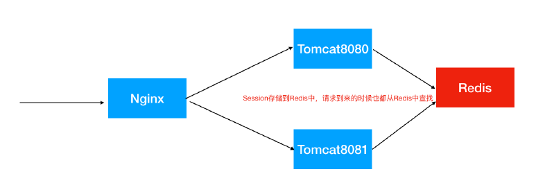

## 分布式集群场景下潜在问题以及Web服务综合解决方案

### 一致性hash问题及解决方案

* 普通Hash算法实现
* 一致性Hash不含虚拟节点
* 一致性Hash含虚拟节点

### 分布式id

* UUID
* 独⽴数据库的⾃增ID（不推荐，麻烦）

```
⽐如A表分表为A1表和A2表，那么肯定不能让A1表和A2表的ID⾃增，那么ID怎么获取呢？我们可
以单独的创建⼀个Mysql数据库，在这个数据库中创建⼀张表，这张表的ID设置为⾃增，其他地⽅
需要全局唯⼀ID的时候，就模拟向这个Mysql数据库的这张表中模拟插⼊⼀条记录，此时ID会⾃
增，然后我们可以通过Mysql的select last_insert_id() 获取到刚刚这张表中⾃增⽣成的ID.

DROP TABLE IF EXISTS `DISTRIBUTE_ID`;
CREATE TABLE `DISTRIBUTE_ID` (
`id` bigint(32) NOT NULL AUTO_INCREMENT COMMENT '主键',
`createtime` datetime DEFAULT NULL,
PRIMARY KEY (`id`)
) ENGINE=InnoDB DEFAULT CHARSET=utf8;

insert into DISTRIBUTE_ID(createtime) values(NOW());
select LAST_INSERT_ID()；
```
* SnowFlake 雪花算法（可以⽤，推荐）
* 借助Redis的Incr命令获取全局唯⼀ID（推荐）

### 分布式调度

* Quartz
* elastic-job
```
表数据使用time-job/src/main/resources/elastic-job-test.sql，可模拟任务分片以及高可用
```

### Session一致性
* Nginx的IP_HASH负载均衡策略
```
同⼀个客户端IP的请求都会被路由到同⼀个⽬标服务器，也叫做会话粘滞
优点：
配置简单，不⼊侵应⽤，不需要额外修改代码
缺点：
服务器重启Session丢失
存在单点负载⾼的⻛险
单点故障问题
```
* Session共享，Session集中存储（推荐）
```
优点:
能适应各种负载均衡策略
服务器重启或者宕机不会造成Session丢失
扩展能⼒强
适合⼤集群数量使⽤
缺点：
对应⽤有⼊侵，引⼊了和Redis的交互代码

Spring Session使得基于Redis的Session共享应⽤起来⾮常之简单
```



```
基于login-demo模块，该模块有登录拦截验证，可用于session共享测试
将该模块打包为war包(cd login-demo && mvn clean packge，target下LoginProject.war)，
部署到分布式集群架构中，一个ngnix节点，两个tomcat节点，如上图所示
—> Nginx（轮询策略） —> Tomcat1—> Tomcat2
具体Nginx/tomcat配置可参考docs目录下，LoginProject.war放入tomcat1和tomcat2的webapps目录下即可
```